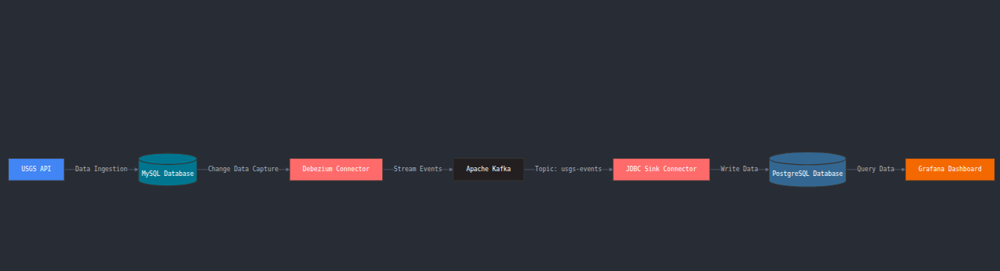
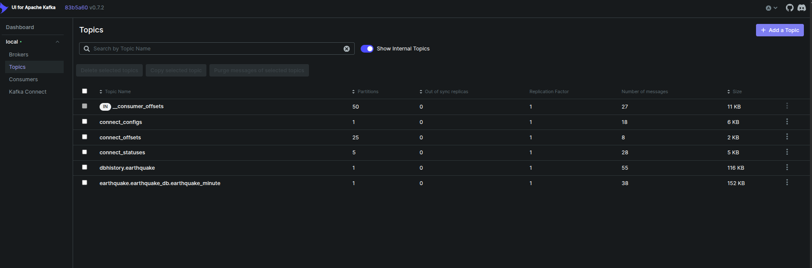
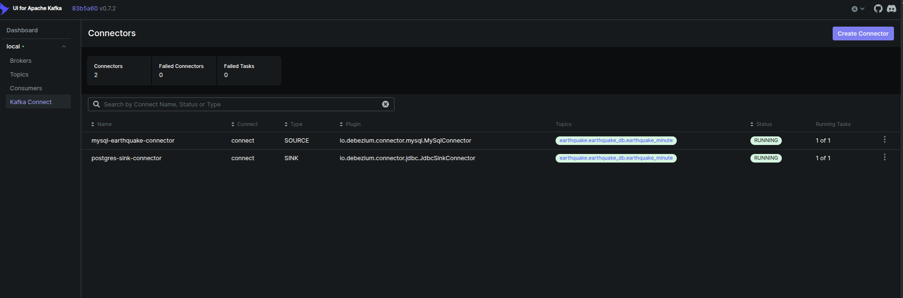
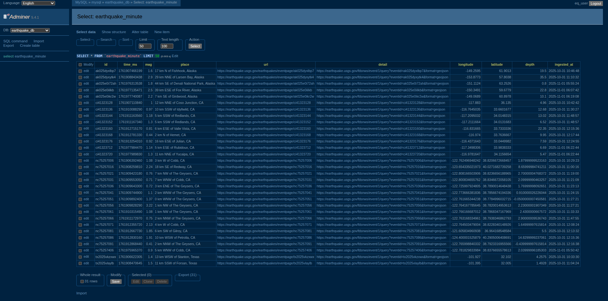
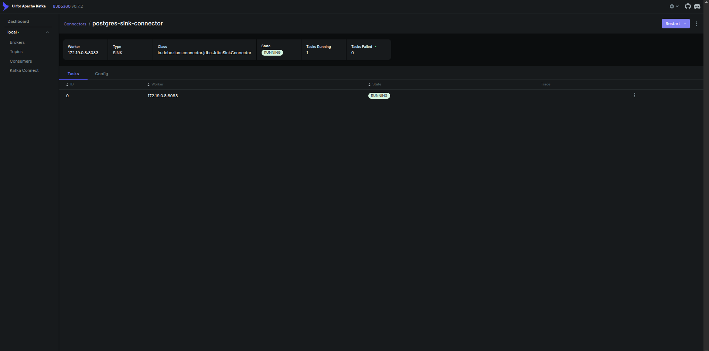
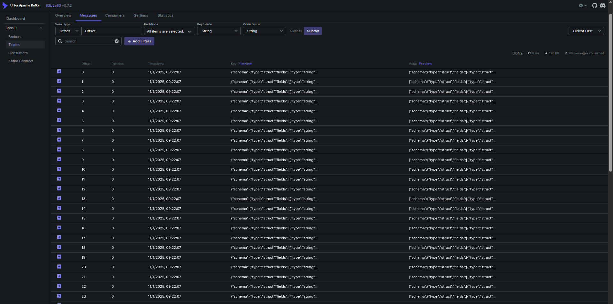

# Real-Time Earthquake CDC Pipeline

Bringing live seismic data to life from API to dashboards, in seconds. This project builds a real-time Change Data Capture(CDC) pipeline that streams live earthquake data from the  into **MySQL**, mirrors every change through **Kafka + Debezium**, lands it to **PostgreSQL**, and visualizes global seismic trends **Grafana**.

## Project Overview

Every minute, the U.S. Geological Survey(USGS) publishes new earthquake events around the world.
In this project, we built a pipeline that:
**1. Fetches** new quakes every minute from the USGS API
**2. Upserts** events into MySQL
**3. Capture Changes** in real-time via Debezium & Kafka
**4. Streams** them into PostgreSQL
**5. Visualizes** live quakes and metrics in Grafana dashboards


*Overall system architecture diagram*

## Architecture
```
USGS API → MySQL → Debezium → Kafka → JDBC Sink → PostgreSQL → Grafana

```
Each component plays a critical role:
**- MySQL** - Primary database storing fresh quake data
**- Adminer UI** - Visualizes our data in primary MySQL database after API ingestion
**- Debezium** - Captures every insert/update via CDC
**- Kafka** - Streams events through topics
**- PostgreSQL** - Sink database for analytics
**- Grafana** - Visualization layer for insights
**- Kafka UI** - Monitors topics and connectors visually


*Kafka UI showing topics*


*Sink and Source Connectors*

## Phases of the Build
### Phase 1: USGS API Integration
A Python script polls the API:
```bash
https://earthquake.usgs.gov/fdsnws/event/1/query?format=geojson&starttime={NOW-1min}&endtime={NOW}

```
New events are upserted into `earthquake_minute` table in MySQL.


*Sample MySQL table rows after API ingestion in Adminer UI*

### Phase 2: Change-Data-Capture(CDC)
- MySQL binary logging enabled (`binlog_format=ROW`)
- Debezium MySQL connector listens for changes
- Kafka topics carry those changes
- JDBC Sink connector writes them to PostgrSQL


*Debezium connector configuration (Kafka Connect UI)*


*Kafka UI → Topics → Messages view*