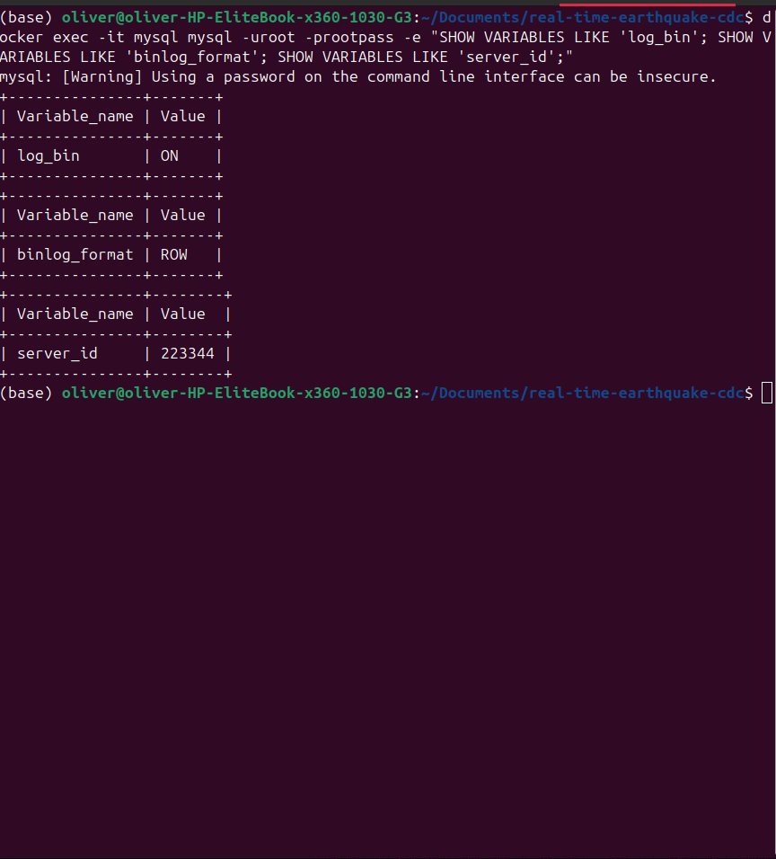
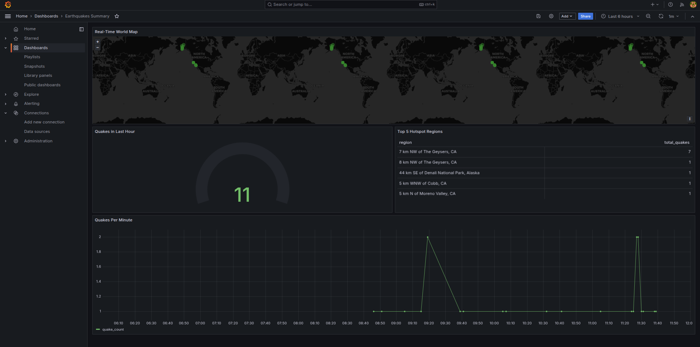
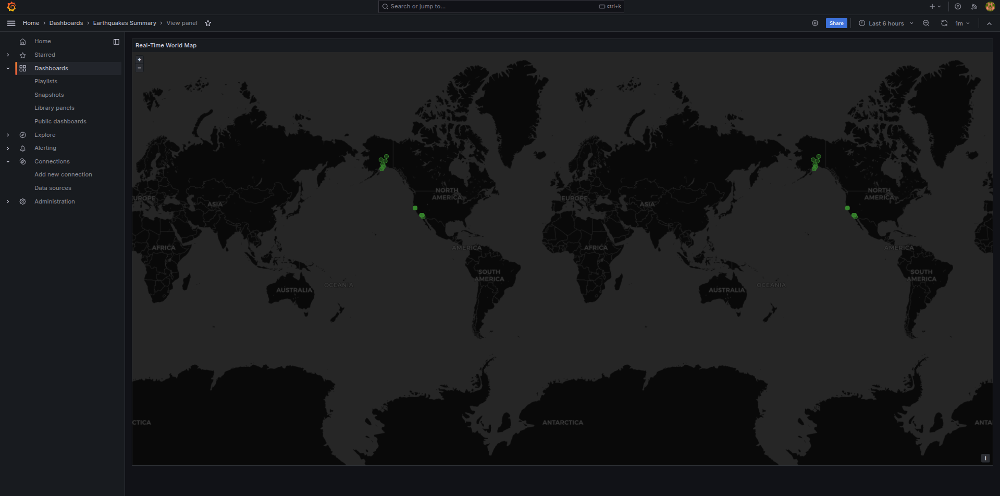
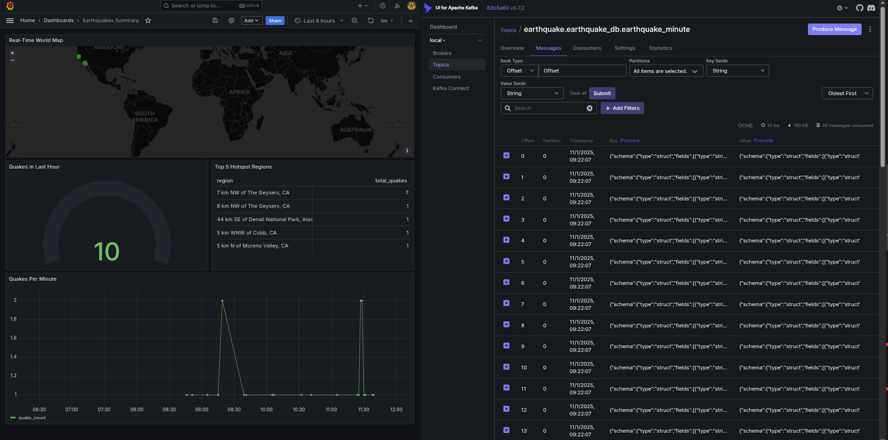

# Real-Time Earthquake CDC Pipeline

Bringing live seismic data to life from API to dashboards, in seconds. This project builds a real-time Change Data Capture(CDC) pipeline that streams live earthquake data from the  into **MySQL**, mirrors every change through **Kafka + Debezium**, lands it to **PostgreSQL**, and visualizes global seismic trends **Grafana**.

## Project Overview

Every minute, the U.S. Geological Survey(USGS) publishes new earthquake events around the world.
In this project, we built a pipeline that:
**1. Fetches** new quakes every minute from the USGS API
**2. Upserts** events into MySQL
**3. Capture Changes** in real-time via Debezium & Kafka
**4. Streams** them into PostgreSQL
**5. Visualizes** live quakes and metrics in Grafana dashboards


*Overall system architecture diagram*

## Architecture
```
USGS API → MySQL → Debezium → Kafka → JDBC Sink → PostgreSQL → Grafana

```
Each component plays a critical role:
**- MySQL** - Primary database storing fresh quake data
**- Adminer UI** - Visualizes our data in primary MySQL database after API ingestion
**- Debezium** - Captures every insert/update via CDC
**- Kafka** - Streams events through topics
**- PostgreSQL** - Sink database for analytics
**- Grafana** - Visualization layer for insights
**- Kafka UI** - Monitors topics and connectors visually


*Kafka UI showing topics*


*Sink and Source Connectors*

## Phases of the Build
### Phase 1: USGS API Integration
A Python script polls the API:
```bash
https://earthquake.usgs.gov/fdsnws/event/1/query?format=geojson&starttime={NOW-1min}&endtime={NOW}

```
New events are upserted into `earthquake_minute` table in MySQL.


*Sample MySQL table rows after API ingestion in Adminer UI*

### Phase 2: Change-Data-Capture(CDC)
- MySQL binary logging enabled (`binlog_format=ROW`)
    *Understanding the Binlog*
    At the core of this project lies **MySQL's Binary log(binlog), a special journal that records every change made to the database: inserts, updates, and deletes.

    By enabling it in **ROW format**, MySQL doesn't just log that "something changed". It records **exactly what changed** in each row. This is what allows tools like **Debezium** to reconstruct the full story for every database mutation in real-time.
    

    **Why it Matters**
    - `log_bin = ON` - Enables binary logging
    - `binlog_format = ROW` - Captures row-level detail for CDC
    - `server_id` - Provides a unique identifier for the MySQL instance(required by Debezium)

    Once the binlog is active, Debezium can tap into it via Kafka Connect, continuously streaming every change into Kafka topics—turning your database into a real-time data source.

- Debezium MySQL connector listens for changes
- Kafka topics carry those changes
- JDBC Sink connector writes them to PostgrSQL


*Debezium connector configuration (Kafka Connect UI)*


*Kafka UI → Topics → Messages view*

### Phase 3: Grafana Visualization
Grafana connects to PostgreSQL and brings seismic data to life through four panels:
**1. Real-Time World Map** – Global quake visualization
**2. Quakes Per Hour** – Time-series trend of activity
**3 Top 5 Hotspot Regions** – Aggregated regional summary
**4 Quakes in Last Minute (Gauge)** – Real-time activity level


*Grafana dashboard (full view)*


*Close-up of world map panel*

## Conclusion
This project demonstrates the power of streaming data from a global earthquake API to actionable visualizations in real time.
By Combining open-source tools like **Debezium**, **Kafka**, and **Grafana**, we built a pipeline that's not just functional but alive constantly evolving with Earth's tremors.



### Quick Start
```bash
# Start all services
docker compose up -d

# Access components
MySQL        → localhost:3306
Kafka UI     → http://localhost:8082
Grafana      → http://localhost:3000
PostgreSQL   → localhost:5435
Adminer UI   → http://localhost:8080
```