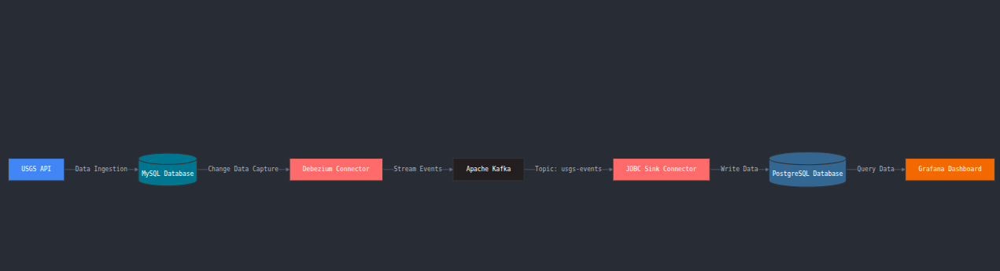
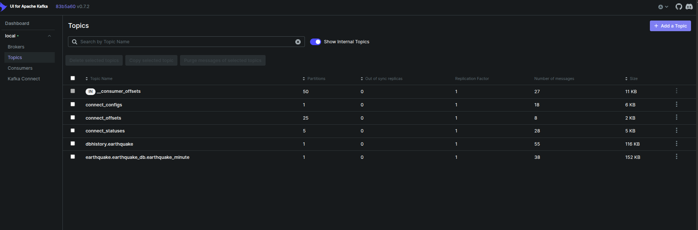
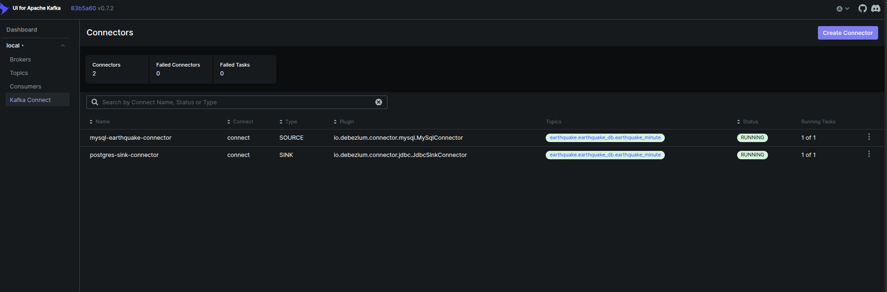
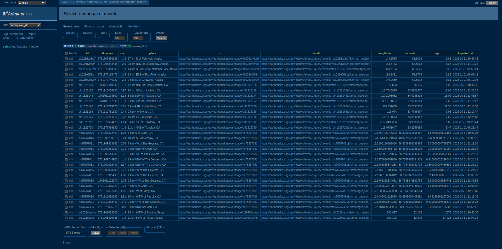

# Real-Time Earthquake CDC Pipeline

Bringing live seismic data to life from API to dashboards, in seconds. This project builds a real-time Change Data Capture (CDC) pipeline that streams live earthquake data from the [USGS FDSN API](https://earthquake.usgs.gov/fdsnws/event/1/) into **MySQL**, mirrors every change through **Kafka + Debezium**, lands it in **PostgreSQL**, and visualizes global seismic trends in **Grafana**.

## Project Overview

Earthquakes happen without warning, and understanding their patterns requires timely data. Traditional earthquake monitoring architectures often introduce delays between when an event occurs and when data is available for downstream analytics. This pipeline minimizes that latency while keeping operational systems decoupled from analytical query loads.

**Why it Matters:**
- **Decoupled Architecture:** Analytics and visualization run on a dedicated OLAP sink (PostgreSQL), isolating the operational database from heavy read queries.
- **Revision Handling:** Historical earthquake revisions by USGS are captured automatically via Change Data Capture (CDC).
- **Downtime Resilience:** High-watermark polling ensures no data gaps are created if the ingestion service restarts or recovers from downtime.

Every minute, the U.S. Geological Survey (USGS) publishes new and revised earthquake events around the world.
In this project, I built a pipeline that:

**1. Fetches** new and updated quakes using `updatedafter` watermarking from the USGS API

**2. Upserts** events into MySQL (serving as an operational OLTP database proxy)

**3. Captures Changes** in real-time via Debezium & Kafka

**4. Streams** change events asynchronously into PostgreSQL

**5. Visualizes** live quakes and metrics in Grafana dashboards


*Overall system architecture diagram*

## Architecture
USGS API → MySQL → Debezium → Kafka → JDBC Sink → PostgreSQL → Grafana


Each component plays a critical role:

**- MySQL** - Operational database standing in as an OLTP engine where API ingestion updates take place.

**- Adminer UI** - Visualizes data in the primary MySQL database after API ingestion.

**- Debezium** - Captures every insert and update at the log level via CDC without querying MySQL directly.

**- Kafka** - Streams database change events asynchronously through distributed topics.

**- PostgreSQL** - Analytical sink database dedicated to reporting and downstream visualization.

**- Grafana** - Visualization layer querying PostgreSQL for real-time dashboard insights.

**- Kafka UI** - Monitors topics and connectors visually.


*Kafka UI showing topics*


*Sink and Source Connectors*

### Design Rationale: Why write API data into MySQL first?
In production enterprise architectures, analytical consumers and reporting tools are rarely given direct read access to primary operational databases (OLTP) for performance and security reasons. Heavy analytical queries on operational databases risk locking tables or causing microservice latency.

In this project, **MySQL stands in as an operational database proxy** to simulate a live transactional service receiving event updates. By using Debezium CDC on MySQL's row-based binary log, changes are streamed asynchronously through Kafka to PostgreSQL (the analytical sink) without adding read contention or query load to MySQL.


*Earthquake MySQL table rows after API ingestion in Adminer UI*

---

## Phases of the Build

### Phase 1: USGS API Integration & Resilience

**What's happening here:** The USGS maintains a public API reporting global seismic activity. The Python ingestion engine polls this API every 60 seconds.

**Handling Revisions & Downtime Gaps:**
USGS frequently revises earthquake magnitude, depth, and epicenter location minutes or hours after initial detection as additional sensor data arrives. Furthermore, fixed time-window polling (`starttime`/`endtime`) would lose data during ingestor downtime.

To solve both challenges:
1. **`updatedafter` Watermarking:** The API is queried using the `updatedafter` parameter, bound to `MAX(updated_ms)` stored in MySQL (minus a 1-minute overlap safety buffer). This guarantees fetching both new events and historical event updates, while automatically recovering missing data after downtime.
2. **CDC-Compatible Upserts:** Records are staged into MySQL using `ON DUPLICATE KEY UPDATE` (`UPSERT`). When historical records are revised, MySQL executes an `UPDATE`, emitting a binary log event that Debezium captures and streams downstream.

A Python script polls the API:
```bash
https://earthquake.usgs.gov/fdsnws/event/1/query?format=geojson&updatedafter={MAX_UPDATED_TIMESTAMP}
New and updated events are staged into the earthquake_minute table in MySQL.

Phase 2: Change Data Capture (CDC)
Change Data Capture (CDC) enables event-driven database replication. Without CDC, downstream systems would need to repeatedly query MySQL ("polling the database"), causing slow performance and database load. With CDC, MySQL's binary log notifies Debezium the instant a row is inserted or updated.

MySQL binary logging enabled (binlog_format=ROW) Understanding the Binlog At the core of this pipeline lies MySQL's Binary log (binlog), a special journal that records database changes (inserts, updates, deletes) at the row level.

By enabling it in ROW format, MySQL records exactly what changed in each row. Debezium taps into this log via Kafka Connect, continuously streaming changes into Kafka topics in real time. Binlog Settings

Why it Matters:

log_bin = ON - Enables binary logging
binlog_format = ROW - Captures row-level detail required for CDC
server_id - Provides a unique identifier for the MySQL instance (required by Debezium)
Debezium MySQL connector listens for binary log events

Kafka topics carry change events asynchronously

JDBC Sink connector writes/upserts them into PostgreSQL

Debezium connector configuration (Kafka Connect UI) Debezium connector configuration (Kafka Connect UI)

Kafka UI → Topics → Messages view Kafka UI → Topics → Messages view

Phase 3: Grafana Visualization & Testing
Grafana connects to PostgreSQL and brings seismic data to life through four panels:

1. Real-Time World Map — Global quake visualization showing seismic event epicenters.

2. Quakes Per Hour — Time-series trend tracking seismic activity over time.

3. Top 5 Hotspot Regions — Aggregated regional summary of highly active seismic areas.

4. Quakes in Last Hour (Gauge) — Pulse check gauge showing immediate activity levels.

Grafana dashboard Grafana dashboard (full view)

Close-up of world map panel Close-up of world map panel

Testing & CI/CD Pipeline
To ensure reliability and code quality:

Unit Testing: pytest test suite in tests/test_ingestion.py verifies data models, schema definitions, and API fetching logic using mocks.
CI/CD: GitHub Actions workflow in .github/workflows/ci.yml automatically runs tests on every push and pull request.
To run tests locally:

PYTHONPATH=. pytest
Conclusion
This project demonstrates the implementation of an event-driven Change Data Capture pipeline streaming seismic data from REST APIs to interactive dashboards. By combining open-source tools like Debezium, Kafka, PostgreSQL, and Grafana, this architecture decouples transactional operational workloads from downstream analytical processing.

What was accomplished:

Building an end-to-end CDC data streaming pipeline using open-source tools.
Orchestrating multi-container infrastructure using Docker Compose.
Eliminating data gaps and capturing historical event revisions using updatedafter watermarking and MySQL upserts.
Decoupling operational database workloads from analytical reporting.
Grafana + Kafka UI side-by-side for the closing shot

Quick Start
# Start all services
docker compose up -d

# Run automated tests
PYTHONPATH=. pytest

# Access components
MySQL        → localhost:3306
Kafka UI     → http://localhost:8082
Grafana      → http://localhost:3000
PostgreSQL   → localhost:5435
Adminer UI   → http://localhost:8085

---
